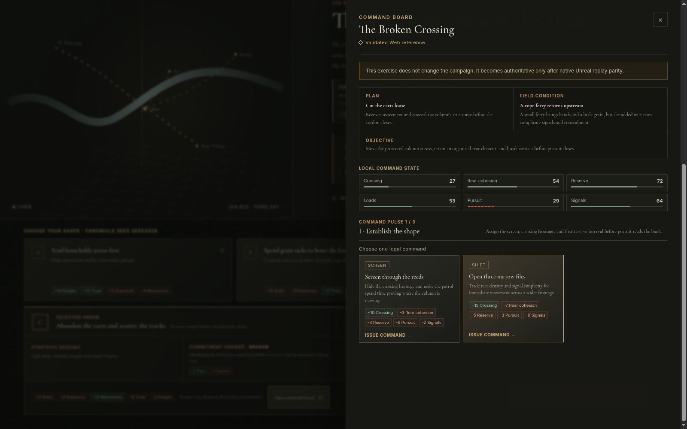

[English](README.md) · [العربية](i18n/README.ar.md) · [Español](i18n/README.es.md) · [Français](i18n/README.fr.md) · [日本語](i18n/README.ja.md) · [한국어](i18n/README.ko.md) · [Tiếng Việt](i18n/README.vi.md) · [中文 (简体)](i18n/README.zh-Hans.md) · [中文（繁體）](i18n/README.zh-Hant.md) · [Deutsch](i18n/README.de.md) · [Русский](i18n/README.ru.md)

[](https://github.com/lachlanchen/lachlanchen/blob/main/figs/banner.png)

# SHI · The Shape of Power / 《势》

*A beautiful, historically grounded strategy narrative about how people, terrain, time, belief, logistics, and institutions become power.*

[](https://github.com/lachlanchen/ShiGame/actions/workflows/ci.yml) [](https://lachlanchen.github.io/ShiGame/) [](apps/unreal/) [](apps/unity/) [](https://github.com/sponsors/lachlanchen)

SHI is a production game project—not a disposable demo. Its first playable chapter begins in the rain at Daze Village in 209 BCE, as a fictional levy-record keeper must decide how a stranded group becomes a political movement. The wider campaign follows the collapse of Qin toward the Chu–Han contention without treating Xiang Yu, Liu Bang, or later victory as inevitable.

| Donate | PayPal | Stripe |
| --- | --- | --- |
| [](https://chat.lazying.art/donate) | [](https://paypal.me/RongzhouChen) | [](https://buy.stripe.com/aFadR8gIaflgfQV6T4fw400) |


## Why SHI is different

- Power is positional: grain, trust, momentum, people, and exposure create opportunities and obligations rather than a single “strength” score.
- Decisions are deliberate orders: compact cards select a doctrine without changing the campaign; one focused reading then discloses its full method, promise, pressure and exact effects before a separately named **Issue order** action commits it.
- At the broken crossing, the selected doctrine opens a three-pulse command exercise: issue only legal orders, read the field's separate answer, manage six local states and carry the resulting cost back to council. Web and native Unreal independently reproduce all 76 legal replays; the exercise remains deliberately non-authoritative over the campaign chronicle.
- Unreal issues that order through one fail-closed transaction: deterministic rule state, the refreshed 3D command signals, the complete consequence camera plan, live actor closure and the candidate save must all validate before the active chronicle advances.
- Opening choices establish a named promise to a visible stakeholder. The promise travels through the chapter, and every choice at the broken ford discloses whether it will keep, strain, or break it—and the exact operational cost—before commitment.
- Choices create counterplay and recovery problems. Every nonterminal decision warns about one exposed weakness, then reveals and records an authored state, terrain, supply, or network response.
- Qin pursuit is a persistent, readable opponent: the current Exposure band, exact added pressure and a concrete counterplay are disclosed before commitment and recorded afterward.
- Qin also forms a deterministic, disclosed read of repeated strategic methods. The selected-order reading names its method and shows whether the prepared counter will hit; changing method makes the read miss.
- Every new chronicle receives a shareable seed that selects a small authored field condition. The exact signal and effects are disclosed before commitment, recorded afterward, and explicitly labeled dramatic reconstruction.
- Historical accounts, later compilations, strategic texts, and dramatic reconstructions are visibly separated.
- The wartable is playable intelligence, not decoration: known ground, reported networks and reference-only places expose uncertainty and claim-filtered evidence without leaking later victory into the opening scene.
- A shared opt-in soundscape gives rain, focus, inspection and consequence a restrained procedural language. Ambience and effects mix independently, sound never carries exclusive information, deterministic and actual-browser output pass objective audio gates, and human listening approval remains an open release gate.
- One versioned campaign payload drives the polished web client, priority Unreal 5.8 cinematic client and maintained Unity 6 baseline.
- English, Arabic, German, Spanish, French, Japanese, Korean, Russian, Vietnamese, Simplified Chinese, and Traditional Chinese UI foundations are present, including Arabic RTL.
- Every generated art or 3D asset keeps provenance and a review trail; rejected revisions remain documented.



## Current contents

| Path | What is real now |
| --- | --- |
| [`apps/web`](apps/web/) | Playable React/Vite client, compact select-only campaign orders plus a non-authoritative three-pulse broken-crossing command board with plan/condition binding, legal-order filtering, separate field answers, local-state meters, outcome preview and pointer/keyboard/standard-gamepad operation; lazy Three.js atmosphere/intelligence map and Web Audio soundscape, replayable save-v6 migration, carried commitments, persistent pursuit, strategic-method reads and seeded field signals, first-run guide, six-layer records, responsive layouts and Arabic RTL |
| [`apps/unreal`](apps/unreal/) | Priority Unreal Engine 5.8 C++ cinematic client: official UE 5.8.1 native compile and eleven-suite automation; canonical schema-v7/audio/edition/character loaders; independent 46-route campaign and 76-route command replay; fail-closed durable-first order/restart transactions; complete six-scene progression; bounded five-site wartable plus live resource/field/pursuit/method/oath signals; deterministic speaker/Keeper blocking; scoped historical basis; six-or-seven-beat consequence cinema; opt-in procedural audio; a verified Linux Development package that visibly seals and cold-resumes the chapter; and one reviewed authored prop whose LOD/UV/material/collision/cook/launch admission passes. The prop is not placed or final-shaded; council figures, terrain and formations remain engineering proxies. |
| [`apps/unity`](apps/unity/) | Unity 6 LTS project consuming the same campaign/audio contracts, matching select/inspect/issue-order flow, selectable/raycasted 3D wartable markers, procedural rain/cues, localized mixer/intelligence/guide/record/gamepad UI, native preflight/build automation and EditMode tests; license/import gate is documented |
| [`content`](content/) | Chapter I with 6 scenes, 15 method-tagged choices, 3 carried commitments and 9 exact answers, 12 pressure responses, 3 classified pursuit postures, 3 strategic methods, 3 prepared counters plus a neutral read, 12 classified field conditions, 5 resources, a recovery turn, 3 conclusions, 7 source records, 13 claim records, 5 registered editions, one versioned procedural-audio contract, a hash-bound 46-route cross-engine corpus and a non-authoritative broken-crossing engagement candidate |
| [`packages/game-core`](packages/game-core/) | Seed-reproducible six-layer campaign resolution plus the pure three-pulse broken-crossing command resolver, authoritative replay/migration and tamper rejection, player and opponent memory, requirements, failure thresholds, exhaustive campaign and 76-route engagement validation, localization fallback, and tests |
| [`assets`](assets/) | Reviewed Daze/Broken Crossing lookdev plus AgenticApp/Blender wartable and command-weight source, previews, `.blend`, GLB/FBX LODs, rejected-trial records and SHA-256 provenance |
| [`docs`](docs/) | Game design, history policy, architecture, localization, accessibility/audio contracts, art direction, engine status, release gates, measured QA evidence, and one-year roadmap |

## Quick start

Requires Node.js 22+.

```bash
npm install
npm run dev
```

Open `http://127.0.0.1:5173`. To verify the production checkpoint:

```bash
npm run validate
npm run build
```

Unreal and Unity instructions plus the remaining editor, hardware, human-review and asset gates are in [`apps/unreal/README.md`](apps/unreal/README.md), [`apps/unity/README.md`](apps/unity/README.md), and [`docs/production/ENGINE_STATUS.md`](docs/production/ENGINE_STATUS.md).

## Architecture and research baseline

```text
historical claims + authored reconstruction + audio contract
                         ↓
              versioned shared JSON + validation + SHA-256
              ↙                 ↓                    ↘
TypeScript rules + Web       Unreal 5.8 C++       Unity 6 C#
React/Three/Web Audio    priority cinematic 3D    maintained baseline
```

Private books, OCR collections, chat extracts, downloads, and the complete working memo remain outside Git. The project records pinpoint metadata and reviewed original prose rather than publishing source files. Read the [game design document](docs/design/GAME_DESIGN_DOCUMENT.md), [historical martial-command contract](docs/design/HISTORICAL_MARTIAL_COMMAND.md), [martial-source review queue](docs/history/MARTIAL_SOURCE_REVIEW.md), [deliberate-order contract](docs/design/DELIBERATE_ORDER_FLOW.md), [player commitment contract](docs/design/PLAYER_COMMITMENT_MEMORY.md), [opposition posture contract](docs/design/OPPOSITION_POSTURE.md), [opposition method-read contract](docs/design/OPPOSITION_METHOD_READ.md), [wartable intelligence contract](docs/design/WARTABLE_INTELLIGENCE.md), [Unreal command-space signal contract](docs/design/COMMAND_SPACE_SIGNALS.md), [Unreal order-transaction contract](docs/design/UNREAL_ORDER_TRANSACTION.md), [Unreal canonical council-staging contract](docs/design/UNREAL_COUNCIL_STAGING.md), [Unreal consequence-cinema contract](docs/design/UNREAL_CONSEQUENCE_CINEMA.md), [historical review system](docs/history/HISTORICAL_REVIEW_SYSTEM.md), [edition register](docs/history/EDITION_REGISTER.md), [seeded uncertainty contract](docs/design/SEEDED_UNCERTAINTY.md), [audio direction](docs/art/AUDIO_DIRECTION.md), [source policy](docs/history/SOURCE_POLICY.md), [accessibility contract](docs/production/ACCESSIBILITY.md), and [one-year roadmap](docs/production/ROADMAP.md).

## Build and validation

`npm run validate` checks the edition/rights register, campaign graph and three-act chronology, source-to-claim-to-scene/site closure, intelligence states, reconstruction boundaries, localization, six-layer rules, save migration, every field-condition branch, the 76-route non-authoritative engagement contract, the regenerated 46-route conformance corpus, synchronized Web/Unreal/Unity payloads, the Unreal project contract, audio/provenance, accessibility and font/privacy contracts, types, automated tests and representative axe scans. `npm run build` additionally enforces initial/lazy/font/deployment size budgets. The visible noVNC/Chrome gate adds 264 checks, including the complete three-pulse controller-driven command exercise and campaign-horizon rail, to the selection, commitment, opposition, accessibility, localization, input, audio and network checks. A second isolated visible-Chrome/PipeWire gate records actual output, proves exact silence before consent and enforces peak, EBU R128 loudness, DC and channel parity. Evidence and reproduction details are in [`docs/production/PLAYTESTING.md`](docs/production/PLAYTESTING.md).

## Citation

If you use SHI in research or teaching, cite the repository. GitHub reads [CITATION.cff](CITATION.cff) and shows a **Cite this repository** panel.

```bibtex
@software{chen_shi_2026,
  author = {Chen, Lachlan},
  title = {SHI: The Shape of Power},
  year = {2026},
  url = {https://github.com/lachlanchen/ShiGame}
}
```

## Status and scope

Pre-alpha schema-v7/Unreal-priority checkpoint, 2026-08-10. The production build passes 57 TypeScript/UI tests, all 76 engagement routes, 689 successful and 87 capture/scattering campaign condition routes, the 46-route cross-engine corpus, Unreal/history/audio/accessibility/font/privacy gates and every bundle budget. The SHA-pinned visible Web route passes 264 checks across the complete chapter, pointer/keyboard/standard-gamepad command play, responsive layouts, all eleven locales, axe states, forced colors, reflow and actual 400% browser zoom with zero console errors or remote/failed requests. Hosted validation `31328036208` and Pages deployment `31328036200` pass at command-weight implementation `decfa4c95dc6ba9ec91f9f8349b357a11c0255d3`; the public game is HTTP 200.

Epic's official UE 5.8.1 installed build now compiles and links the C++ project and passes exactly eleven native suites against the byte-identical campaign and engagement payloads. The archived normal-thread Linux Development player visibly completes the three-pulse Broken Crossing exercise without mutating the campaign save, then completes, seals and cold-resumes the full four-decision chapter. A physical-display chart records 195.18 FPS average and zero hitches. Real packaged attacks against save writes, restart writes, council figures and command actors fail closed without chronicle drift; cuts-only presentation persists; direct SDL/PipeWire capture proves silence before consent and after disable plus bounded non-silent output after explicit opt-in. Evidence is recorded in [`unreal-linux-package-status.json`](docs/production/evidence/unreal-linux-package-status.json) and [`unreal-runtime-acceptance-status.json`](docs/production/evidence/unreal-runtime-acceptance-status.json).

The first original command-weight prop now passes a separate end-to-end technical admission: deterministic Blender source and clean GLB/FBX validation, exact UE 5.8.1 LOD/UV/material/collision inspection, an isolated 499-package cook whose content records name all three assets, and a clean archived-player launch. This means the object is usable by the engine; it does not mean it is placed, final-shaded, historically attested or cinematically approved. Receipts and remaining gates are in [`unreal-command-weight-import-status.json`](docs/production/evidence/unreal-command-weight-import-status.json).

This is still not final-character or film-quality art, and numerical/audio automation is not human approval. Editor PIE remains red after an NVIDIA Vulkan outdated-swapchain crash even though the packaged player is stable. Physical-controller, human listening and motion-comfort, assistive-technology, observed-player, Qin-law, geography, translation, final terrain/formation/character, licensed Unity runtime and specialist reviews remain open. SHI is a one-year quality-driven production; neither passing automation nor engineering proxies are presented as a finished public alpha.

Copyright © 2026 Lachlan Chen. Public visibility does not grant a reuse license; see [LICENSE.md](LICENSE.md).
