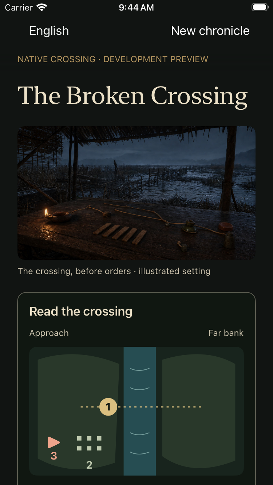

# A setting before the crossing order

October 2, 2026. A reviewed pre-alpha still integrated with the playable scene,
not a film, new historical episode, final character design or store update.

## Continuity decision

The existing crossing concept already establishes the rain, reed shelter,
portable table, cord, slips, low oil lamp and damaged timber crossing. A built-in
image-generation edit retained those features and removed the distant people
and burning settlement. Their presence could falsely imply known survivors or
an event that the player's campaign has not established. No named face, new
costume, victory or defeat was introduced.

The original PNG is retained beside a 1672×941 JPEG delivery copy of about
308 KiB. Encoding changes format only, not crop or composition. Both were
visually inspected. The picture remains deliberately subdued, with readable
river and table detail; it is not used as a background behind gameplay text.
The exact prompt, source/delivery hashes, rights and review limits are recorded
in [provenance](../../assets/provenance/broken-crossing-establishing-v1.json).

The owner's local Tongjian volume-7 extraction, bounded lines 2650–2695, was
reread for rain-disrupted travel and the advance toward Chen. The particular
crossing and its material layout are dramatic reconstruction, not an attested
site or historical construction claim. Main narrative and commentary are not
merged into fabricated quotations; no private page or modern translation is
published.

## Playable integration

Web and native crossing QA display the same image and shared description before
the first crossing order. Saving an order removes it; reopening the save must
not restore a stale establishing view as though it were a consequence. There
is no slideshow, camera drift, timer, autoplay or additional continue button.
The player's next command remains the only way to advance the battle.

The image does not encode tactical information. Eleven-language captions and
descriptions identify it as an illustration, while the adjacent text/diagram
carry game state. A failed Web image request removes the optional figure; absent
native resources leave the text and controls intact. The native resource is
bundled only in crossing QA, not the formal, retreat or upgrade-test app.

## Review scope

The first visible Web route passed 91 checks through crossing, Chen, Fan Yang
and the retreat ending. Its 390×844 scene capture was inspected: the image and
caption fit without covering commands. Focused unit checks cover all label
sets, image failure and disappearance after a committed order. All three native
source configurations typechecked; four generated project manifests passed
source/resource isolation checks.

The focused native test passed **1 test, 0 failures, 0 skips** on iPhone SE
(3rd generation), iOS 26.3.1 simulator. It shows the decoded picture, relaunches
before the order with the same tactical values, commits through the actual
controls, and relaunches again with progress 33 and no stale picture. Both
captures were visually inspected. This focused test is not a new full native
campaign or physical-device qualification. Two setup attempts are retained: an
incorrect QA spec filename stopped the wrapper after successful typechecks;
the first UI assertion mistakenly queried campaign grain rather than the three
tactical indices. The corrected test checks those actual indices and their
expected post-order value without changing game rules.

[Web phone scene](evidence/crossing-establishing-web-20261002.png) uses the same
uncropped delivery asset, with its caption outside the picture.

The final visible development route passed **94 checks**, including an actual
image-only network failure, unchanged pre-order save, a pointer-issued command
without scenery, cold resume and the retreat ending. The missing-image capture
was inspected: no broken placeholder or obstruction. An earlier fault-injection
attempt also blocked Vite's image-import JavaScript module; the corrected harness
intercepts only the image resource, not application code.

The complete production build passed **83 core tests and 395 web tests**, all
content/repository validators and deployment budgets. Initial JavaScript is
99.87 KiB against 100 KiB and initial CSS 11.89 KiB against 12 KiB; this is narrow
headroom, not permission to enlarge the initial bundle. The optional JPEG is a
separate 315,421-byte asset. Build success does not make QA continuation content
public or qualify a signed mobile update.

All review browser processes and their ports were stopped after capture; the
owned native simulators were shut down. No device, signing, store submission or
foreign service was modified. The existing released mobile build remains
separate from this source checkpoint.

This asset is approved by the agent only for bounded pre-alpha scenery. Human
historical/material review, physical-device performance, human enjoyment and
final cinematic acceptance remain open. It does not admit the private Musia
working cue or LocalVideoGen footage. Original sources, not screenshots or
resident processes, remain the reproducible production inputs.
