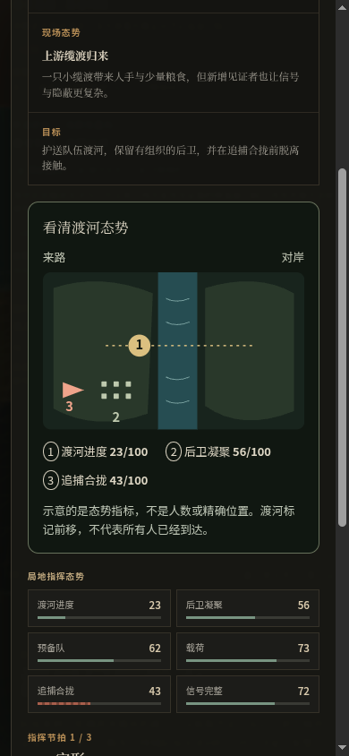
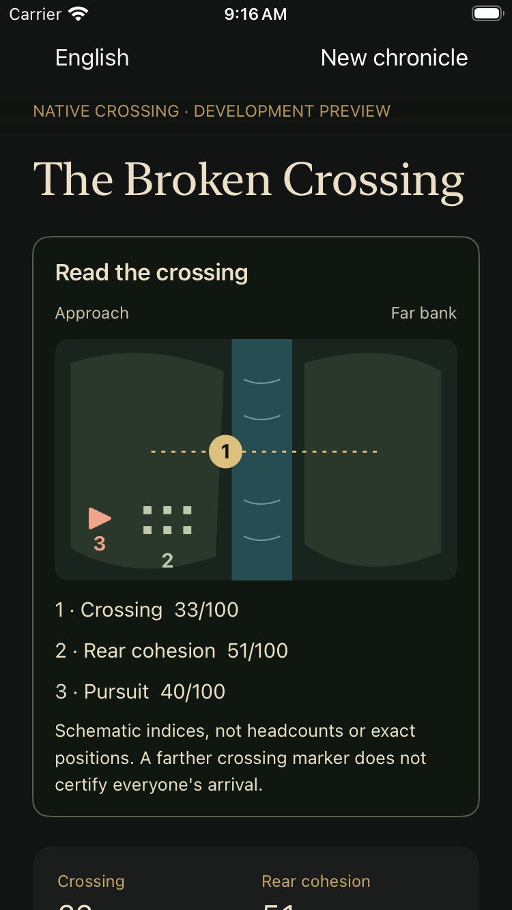

# Crossing: readable spatial feedback

October 2, 2026 (Hong Kong). A player-facing visual checkpoint, not a new
historical episode, film-quality animation or mobile beta.

## What the player gains

The crossing now shows the relationship between forward progress, rear cohesion
and closing pursuit before the player issues an order. The gold marker advances
from saved progress; a looser rear formation means lower cohesion; the pursuit
marker moves closer as its index rises. All three have numbered text equivalents.
The same shared geometry, colors and eleven label sets drive Web SVG and native
SwiftUI presentation. No model download, media request or continuous render loop
is required.

This is a **schematic**, not surveyed geography, a troop count or evidence that
everyone has arrived. That distinction is visible beside the diagram. The
underlying campaign remains grounded in the existing Tongjian claim/source
architecture; no new historical assertion or private book excerpt is introduced.

## Continuity and accessibility

The diagram receives committed metrics only. It has no command, timer, random
generator or persistence callback. Viewing it, changing language and resuming
the game cannot issue another order. It does not replace the personal consequence
scene or the remaining tactical metrics. Shape, number and readable label carry
meaning without color alone; decorative geometry is hidden from screen readers.
Web bank orientation stays fixed in Arabic. Both manual and system reduced-motion
settings suppress marker transitions; forced colors retain the readable legend.

The native resource belongs only to the isolated crossing QA target. Production,
retreat and upgrade targets must not accidentally bundle it. The public Web
reference exercise also uses the diagram, but it remains non-authoritative;
the revised campaign route is still development/internal-only. Publishing source
does not remove those guards or update an installed store app.

## Review evidence

The visible development Web route passed opening → crossing → Chen → Fan Yang →
retreat ending, including 390×844 Chinese and Arabic diagram checks. Switching
language preserved save bytes. One committed order changed progress from 23 to
33; reopening restored the same indicator without another order. Screenshot
inspection confirmed readable numbered labels, a fixed river orientation and no
horizontal overflow. The test additionally checks reduced-motion CSS and reports
no browser runtime exceptions.



[Arabic phone capture](evidence/crossing-field-web-ar-20261002.png) preserves
right-to-left reading while keeping both banks in the same positions. The
existing longer engagement prose still uses its disclosed English fallback;
eleven diagram label sets do not mean the entire story has eleven translations.

An initial Web run exposed the global near-zero-duration accessibility fallback
overriding this component's `transition: none`. The component now explicitly
disables that transition, and the complete route passed on rerun.

Native review uses the same shared definition. The first
small-phone run passed the 23→33/cold-resume checks but then restored a council
from a previous deterministic QA run. Its failure screenshot showed that saved
response, not the expected first offer. The repeatable test now uses the visible
confirmed council restart only on first entry; later cold-resume checks preserve
the newly written council. No save file is deleted or seeded by the harness.

The successor full-route run passed **1 test, 0 failures, 0 skips** on the iPhone
SE (3rd generation), iOS 26.3.1 simulator. It checks both diagram values, the
unread field reaction after relaunch, personal consequence, arrival and three
Chen decisions with another cold resume. Nine captures were exported; the
before/after diagram and completed council were visually inspected. The native
CLI additionally passed 103 bounded projections, missing-metric handling and
eleven label sets. All three native app configurations typechecked, and the four
generated project manifests passed resource/source/identity isolation checks.



The native simulator and local dedicated Web desktop were shut down after
capture, with owned build/test processes and listening ports verified absent.
The [evidence receipt](evidence/crossing-field-20261002.json) records the exact
source and screenshot hashes and the remaining limits.

The complete production build passed 83 core and 393 Web tests, content/type/
accessibility checks and bundle budgets (99.87 KiB initial JavaScript). The
separate internal crossing build also passed validation and its own budgets;
it does not overwrite the public release output. The eleven README structural
checks and nine recorded source/capture hashes passed.

That production-compiled internal candidate then passed 77 visible checks through
crossing, Chen and Fan Yang to its bounded ending, with 23 captures and no runtime
exceptions. Its phone diagram and ending were visually inspected. The later
retreat draft stayed excluded as intended. This is distinct from the longer
development route above, and neither result is a store upload.

See [asset provenance](../../assets/provenance/crossing-field-v1.json). Native
VoiceOver operation, physical-device performance, human enjoyment, and cinematic
media acceptance remain separate gates. Musia B remains the working cue with
the alternatives retained; this checkpoint admits no new audio or video.

## Reproduce

```bash
npm run build
bash scripts/test-native-crossing-field.sh # Existing Mac/Xcode toolchain
node scripts/playtest-retreat-visible.mjs crossing-v2
```

Reuse the documented single SHI browser profile/desktop and stop its owned
processes after evidence capture. Native QA uses the existing isolated simulator,
not a replacement of the owner's installed app.
