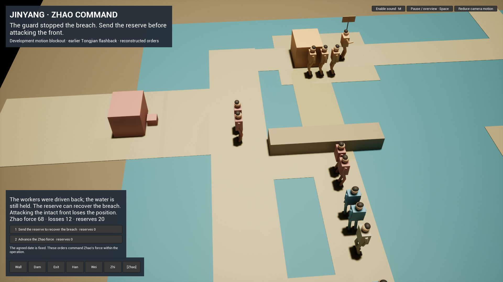
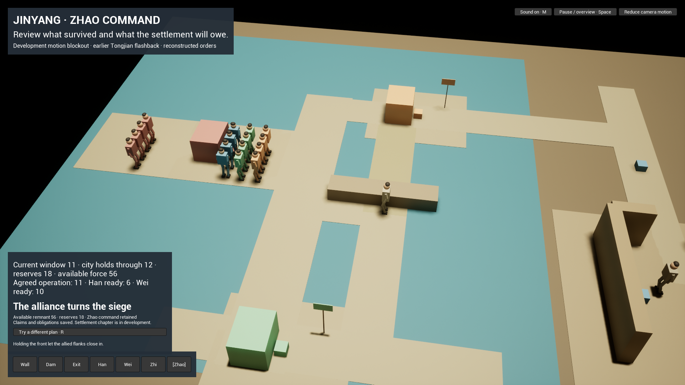
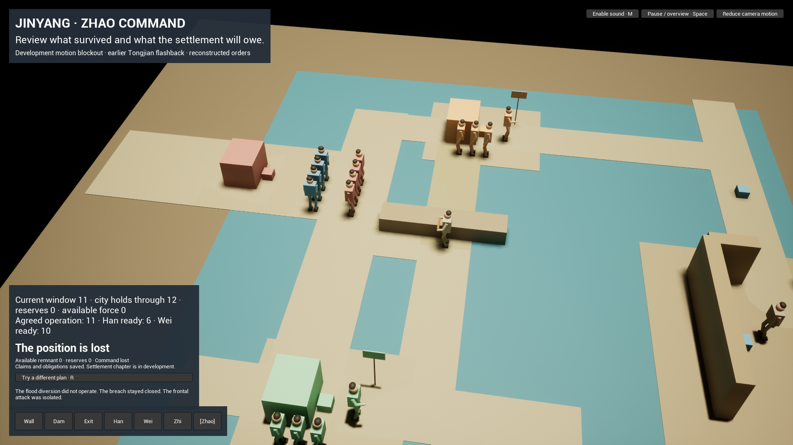
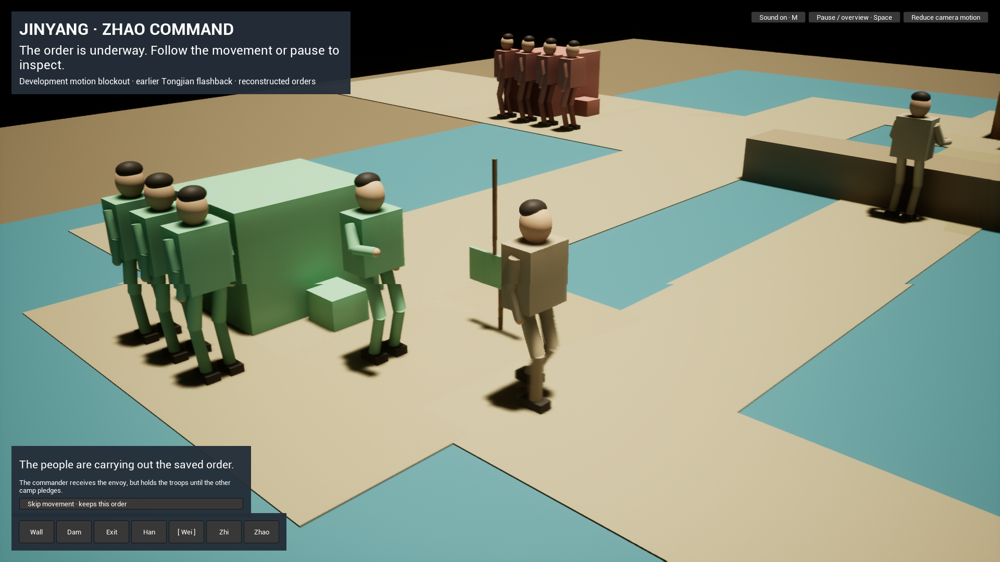
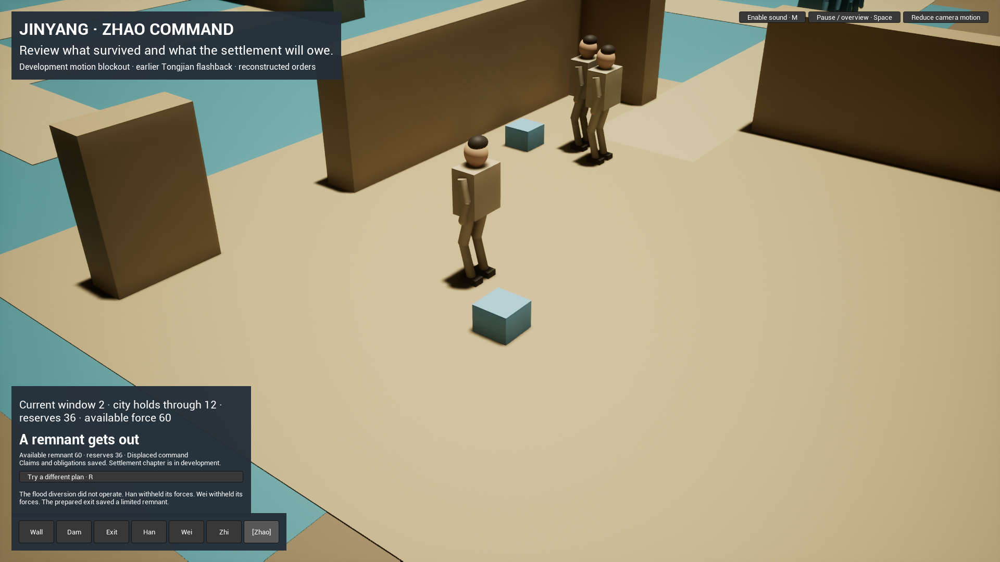
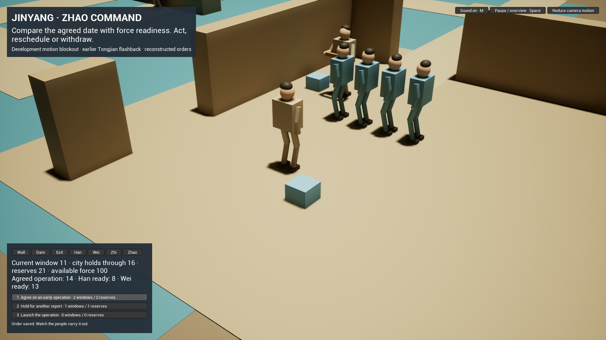
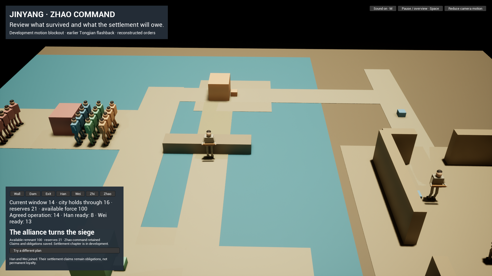

# Jinyang: performed orders to a saved outcome

Development checkpoint, 2026-10-02. **G1 remains open.** This is an interactive Unreal motion blockout, not the requested final cinematic game, a packaged beta, or an update to the public mobile stores. The SHI production skill kept this work focused on the full action-to-ending sequence before detailed asset polish.

## Player-visible change

### Interactive operation — revision 2

Launching a coordinated plan now begins an operation before it awards an ending. The player screens the breach workers or rushes while retaining a reserve. An exposed approach draws extra guards. Rushing that guard causes a local setback; committing the reserve can recover it. After the water opens, Zhao can attack immediately or spend supplies holding its front while Han and Wei close the flanks. The figures, water and camera follow these orders. Nineteen orders share one versioned rule definition.

The original and supplied Chinese translation of Tongjian I's embankment/water/flanks/front sequence were read again. Stronger guards, reserve recovery, command rounds, costs and losses are explicit game reconstruction. Escort costs and exposure are disclosed before dispatch; withdrawal instructions reflect whether an exit was prepared.

| Observed route | Saved consequence | Recording |
| --- | --- | --- |
| Exposed rush, disrupted breach, reserve recovery, hold front, attack | 11 orders; force 56, reserves 18, Zhao command, settlement claim and two obligations | Full uninterrupted actual-input route, 292.07 seconds |
| Same disrupted approach, cold restart, attack intact front | 9 orders; command lost, estate force/treasury 0 | Recorded in two segments around the deliberate restart |
| Prepare exit and withdraw | 2 orders; remnant 60, reserves 36, displaced command | Full uninterrupted actual-input route, 45.27 seconds |

The eight-order disrupted state preserved identical save bytes through pause and cold restart (`2f7cf0cf174c329a87d2bdf06241d81f48208ad44f407ef3c129c03cf3ed6a56`), including force 68, losses 12 and the available reserve. Visual review found overlapping formations at defeat. The final compiled presentation separates them; cold-loading the actual archived defeat preserved its bytes (`a5d3cca70a6b3e88016a97303d17972965d9c232cb1e8ac7ce0c43bef4b872b7`). The movies precede that defeat-only spacing correction; its final cold frame is recorded separately.

Full validation passed: 113 shared-core / 416 web tests. Native replay matched 109 revision-2 and 52 legacy complete states, including all intermediate saves; native motion tests also passed. Linux forced TestExit reports process exit 1 although tests report Success. Three Unreal builds passed: implementation, instruction clarity, then defeat spacing. Review players were closed after capture.







Movies decoded successfully; review covered sampled contact sheets and selected frames. The game's mixer capture contains nonzero sound, with a peak of −22.3 dBFS; physical listening remains unqualified. This roughly five-minute automated route does not establish the intended 15–20-minute human experience. **G1 remains open**, as do final cast, performance, score, film, novice/device and beta gates. See [review receipt](evidence/jinyang-20261002/operation-review.json).

### Interaction successor (revision 1)

The receiving commander now leaves the formation to meet the envoy; a brief receiving gesture and a lowered/raised signal distinguish withheld troops from a date that allows assembly. Pledge relay and date acknowledgement have separate presentation beats. Troops do not advance merely because the player contacted their camp. These gestures and signals are gameplay reconstruction, not authenticated historical signaling practice.

Navigation has a fixed bottom row and commands retain their keyboard numbers when earlier actions disappear. Group lanes are offset; turning is blended; work stations and ending formations share their location, facing and pose across natural completion, skip and cold resume. The wider ending camera includes the changed forces. All figures remain primitive motion blockouts.

Two complete real-input recordings now exist, with no movement skips:

| Recording | Actual route and result | Duration |
| --- | --- | --- |
| Coordination with recovery | Brace, diversion, quiet Han/Wei, relay, early date, reschedule, execute. Wei needs window 13 but the early date is 12; corrected operation 16 succeeds. Estate: reserves 19, commandable force 100, Zhao office, settlement claim and two obligations | 255.67 seconds |
| Withdrawal replay | Two-step restart archives the winning ledger; prepare exit, withdraw. Estate: reserves 36, remnant 60, displaced office, no settlement claim or allied obligations | 45.41 seconds |

The recordings were fully decoded and sampled contact sheets/selected UI frames inspected. That is not every-frame animation approval or a first-time human playtest. Both were recorded at 15 fps; this is a capture setting, not measured engine performance. The first attempted recording stopped before execution because the driver used a now-unavailable dynamic digit; its save and incomplete recording were preserved. The stable-key successor completed both routes.

Cold restart restores the two-order withdrawal without new commands or changed save bytes: `cd8c7e640cf4b382986271a1f226e11ccca20b4b4acf75028139e84fd674bfa5`. The ending summary uses the replay-derived estate, including the remnant rather than the pre-operation force. New native motion-endpoint tests and intermediate reply/readiness/recovery assertions pass alongside 52 complete-state parity checkpoints. An initial test-world double initialization failed; it was corrected and the final tests rerun successfully. Linux forced TestExit remains process exit 1 despite both test results being Success.

**At revision 1, the blockout was still far short of a 15–20-minute chapter.** Its operation resolved from the committed plan and then moved formations, without the limited operation orders and disruption/recovery encounter added in revision 2 above. Adding compulsory waiting would not close the remaining chapter gap.





The player can brace defenses, prepare a flood operation or escape route, dispatch missions to Han and Wei, relay their conditional pledges, agree or correct a date, and execute or withdraw. Work parties, a separate envoy and camp forces move in the same scene. The command view shows the agreed operation date alongside each ally's readiness; outcome feedback uses plain language rather than internal IDs.

Thirteen performed orders update one deterministic contract. Han and Wei remain independent: receiving a proposal is not accepting a pledge, and agreeing is not being ready to act. A movie or movement skip cannot repair an invalid plan. Two winning plans have different time, reserve and available-force costs; an early date can be corrected before final commitment.

The estate/career record retains reserves, available remnant, office status, contacted houses, obligations and a **claim** on the settlement. It does not grant measured acreage, minted gold, a new historical office or household partners. Land/office settlement and adult spouse/concubine relationships belong to the following authored chapters. The legacy field `survivingForce` currently represents the remaining commandable force; escort assignments are not a modeled death toll. All numerical units and route geometry are gameplay reconstruction.

## Earlier revision-1 evidence

| Route in the Unreal player | Performed ledger | Recorded consequence |
| --- | --- | --- |
| Quiet coordination | brace → diversion → quiet Han → quiet Wei → relay → aligned date → execute | Window 14; reserves 21; available force 100; Zhao command; settlement claim; Han/Wei contacts and obligations |
| Prepared withdrawal | escape → withdraw | Window 2; reserves 36; remnant 60; displaced command; no land claim |
| Deadline defeat | diversion → escape → quiet Han → quiet Wei → relay → early date → execute | Window 13 exceeds hold deadline 12; estate force/reserves 0; command lost; prior contacts retained |

These were actual mouse/keyboard orders, not injected ending snapshots. A later repaired build repeated the quiet route. Its cold restart reported seven restored orders and retained the ending, claims and reserves. Save SHA-256 before/after restart: `bbd3fd4c0e5e481aec8241fb1a409ec8e60d96c2ad05f2faf3899a7493e0abbe`.

Pause-to-inspect, skip of the active pledge-relay movement, and cancellation of restart preserved byte-identical committed ledgers. Two-step confirmed restart archived the old route before opening a fresh one. The new save path is separate from every released Qin/Daze save.





Private recordings include a 65-second envoy review, a withdrawal recording, and a 65-second minimized-interface operation review. The operation visibly advances the participating forces, but movement ends before the recording does. **There is not yet one uninterrupted, unskipped 15–20-minute accepted chapter recording.** Selected frames were reviewed; neither a contact sheet nor these stills qualify final animation.

The first review exposed transparent HUD contrast, camp/building intersections, a worker inside the embankment, and troops crossing floodwater. Its successor added opaque panels, raised movement lanes, offset contact/work points, explicit Han/Wei/Zhi role ordering and separated formation destinations. Observed final formations are on dry terrain. That earlier review still had converging group paths, walking turn snaps and inconsistent skipped/resumed work facing. The interaction successor above adds separated lanes, blended turns and tested endpoints; final animation and physical contact quality remain unaccepted.

Audio now has a nonzero **own-game mixer capture**, rather than the earlier silent external captures. The full coordination route's mixer recording lasts 250.52 seconds; FL/FR mean is −43.2 dBFS and peak −22.3 dBFS. Review telemetry shows an active synthesizer, generated samples, application/component volume 1 and focus. This narrows the earlier failure to the output/capture path; it does not prove the exact external capture fault. The shared physical output remains muted and unchanged. Physical listening and target-device audibility remain unqualified; this agent cannot consume audio input. No Musia audition, new score or soundtrack integration is claimed. F8 statistics/F9 own-game mixer recording are available only with the review flag.

## Earlier revision-1 authority and validation

- Contract: `content/encounters/jinyang.v1.json`, explicitly development/reconstruction, source-linked to Tongjian volume 1 and Shiji volume 43. The local original/supplied translation authority is preserved privately.
- Reference model: `packages/game-core/src/jinyang-encounter.ts`; C++ port: `ShiJinyangModel`. Persistence stores the exact mechanical fingerprint and performed-order ledger, then derives the estate by replay.
- Golden fixture: seven routes, 52 complete-state checkpoints. C++ compares every field and replays each prefix; malformed/missing geography is rejected before scene construction.
- `npm run validate`: passed, including TypeScript, 105 core tests, 416 web tests, existing release/save compatibility, source/content, audio-contract, accessibility and repository checks. New Jinyang semantic/conformance checks are part of this command. Existing web accessibility checks do not qualify this new Unreal interface.
- UE 5.8.1 Linux SHIEditor build: succeeded after spatial/readability repairs. Native `SHI.Jinyang.PerformedOrderParity`: Success. Its process exits 1 because Linux's forced `TestExit` calls `_exit(1)`, as checked in the installed engine source; no clean exit-0 claim.
- Existing released campaign hash remains `0144569248b6`. New contract copies match across web, Unity and Unreal; that does not mean Jinyang is playable in the web/Unity/native-mobile clients.

## Reproduce the development scene

Use the verified shared Unreal installation; do not duplicate it. Synchronize content, build SHIEditor, then run:

```bash
npm run sync:content
npm run validate:jinyang
node scripts/launch-jinyang-review.mjs
```

The launcher defaults to the verified shared workstation installation; set `SHI_UNREAL_ROOT` for another UE 5.8.1 installation. It uses the engine Entry map with `/Script/SHI.ShiJinyangGameMode`, a separate chronicle, one isolated display and localhost-only review ports. If another SHI review is running, reuse it; do not launch a duplicate. Ctrl-C owns exact player/desktop cleanup. This is an editor-backed development player, not an installer.

New chronicles default to revision 2. Pass `--legacy` to use revision 1, or `--save=PATH` to open a retained chronicle. The player reads that save's revision and uses its matching definition; it rejects mismatched fingerprints without overwriting the file. There is no automatic conversion of an earned legacy ending into the new operation.

Select a site and use its buttons or fixed keys 1–5. Key 1 performs the site's preparation/quiet mission/pledge relay; key 2 is the escorted mission, prepared withdrawal, or early date as shown at that site. At Zhao command, 3 is the aligned date, 4 waits, and 5 launches. Tab cycles sites; Space pauses; Escape skips movement or cancels restart; H hides the interface; M controls sound. R starts the visible two-step archive/restart confirmation after an ending. The navigation row does not move when panel height changes. Source inspection does not advance strategic time.

Record the same two actual-input routes on an already-owned review, using a fresh chronicle for the first route:

```bash
node scripts/playtest-jinyang-desktop.mjs .runtime/jinyang-desktop-review operation-recovery
node scripts/playtest-jinyang-desktop.mjs .runtime/jinyang-desktop-review withdrawal --archive-restart
```

The recorder checks ownership, does not write saves, fails on an unexpected order, retains existing recordings and requires explicit archive/restart before replacing a completed active route. It does not certify human understanding.

Within the operation, key 1 selects the screen, opens the breach, commits the reserve or holds the front as shown; key 2 selects a rush or frontal attack. The selected command site follows the current task. `--stop-after=open-water` records an intermediate segment; after a real restart, `--continue-route` verifies the saved prefix before recording the remaining orders. Such segments are labeled separately from uninterrupted routes.

Inspect a real ledger without changing it:

```bash
npx vite-node scripts/inspect-jinyang-save.ts --save PATH
```

## Next bounded work

Continue the opening and defense phase as a complete encounter: select a work party, assign competing defense/exit/diversion jobs, see the route and material consequence, then receive a brief source-grounded report before liaison. Carry the result through the existing operation and estate. This should make the chapter easier to follow and give its opening more agency and performance. Preserve the versioned saves/fixtures. Evaluate the whole chapter's pacing in play, without compulsory delays. Physical sound acceptance remains outstanding. Original consistent Blender casting, Musia themes and low-resolution reference-locked LocalVideoGen/MiniMax shots follow the complete G1 loop. Stay within Jinyang and Volume I.

Novice understanding, final period-specific art, dialogue/performance, 15–20-minute pacing, formal encounter schema, full localization/RTL, measured frame times, physical-device tests and new signed beta delivery remain unmet. All review players and their GUI stacks were closed after evidence capture; the temporary owned audio sink was removed. No paid generation, store upload or public rollout occurred.
