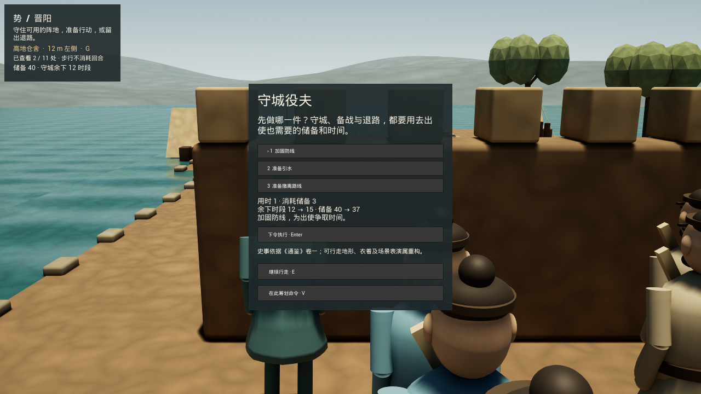
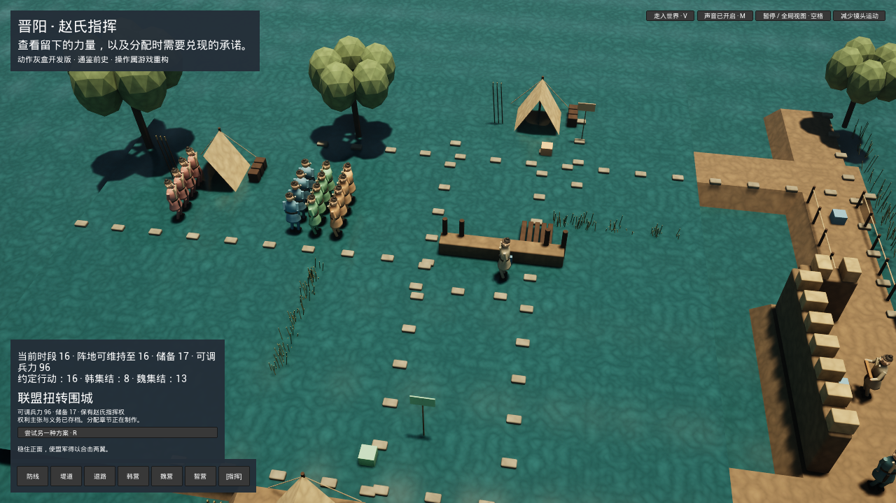
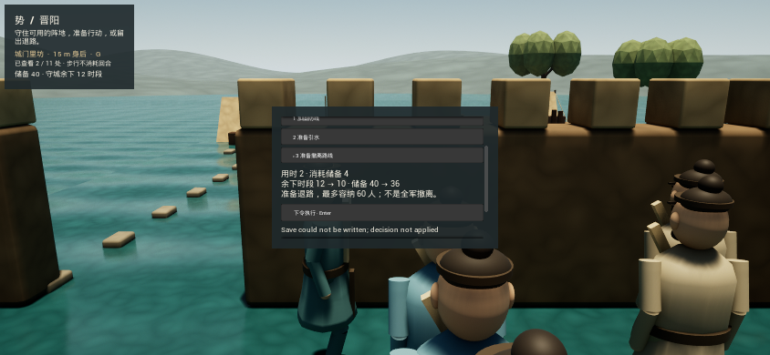

# Jinyang defense and touch — native build checkpoint

2026-10-03. Source: `1b8c8ad7b8bba5ee9ab814e387e0a7732ae5e716` on `work/jinyang-defense-20261003`. This qualifies the previously committed defense/forecast and touch-input implementation for compilation, not for finished gameplay or mobile delivery.

## What is now built

The opening defense interaction is compiled into a new Linux development package: inspect a work location, preview the actual rules' costs without committing, cancel or dispatch an order, and remain in the walking world while its presentation proceeds. The source also includes touch-oriented exploration controls and shared pause/skip/save handling. Their runtime usability still needs the complete input-driven review below.

The previous verified world package is preserved. No new campaign rules, historical claims, art, dialogue or saves were authored in this build checkpoint.

## Verified results

- Official installed Unreal **5.8.1**, changelist **56057345**: `SHIEditor Linux Development` compiled and linked successfully, exit 0. Concurrency was capped at four build actions.
- Fresh native `SHI.Jinyang.` run: **four successful suites**, exit 0 — `ExplorationInterface`, `ExplorationSave`, `MotionEndpoints`, `PerformedOrderParity`. Rules parity covers **52 revision-1 and 109 revision-2 complete-state checkpoints**; the latter suite includes the new forecast assertions.
- The test run retains warnings about headless SDL/Wayland initialization. The engine's Dataflow plugin also reports an uninitialized `FDataflowToolNodeSnapshot::Date` during editor startup; it did not fail the four suites. This is not an error-free engine-startup claim.
- `BuildCookRun` completed build, cook, stage, pak and archive successfully, exit 0. Packaged executable SHA-256: `df74c344081bec935847739ea16123ec59eabc448a5b7408681368b9c0b55fce`.
- Package directory: **1.1 GiB** as measured by `du -sh`, including development/debug artifacts. This is neither a mobile download-size measurement nor acceptance of the intended mobile content budget.
- Content sync, Unreal project contract, Jinyang content validation, both replay fixtures and standalone native input checks passed. No rule/source changes occurred during those checks.

Raw logs, the native automation report, build artifacts and machine-control details remain in the private runtime record. They are not committed as source.

## Mac development setup

The Mac mini now has a working authenticated SSH route and an isolated, loopback-only remote console. UU Remote remains an allowed temporary GUI route; SSH is preferred, and the owner's normal desktop is not a review surface.

Epic sign-in was observed in the native launcher. Official **5.8.3** installation was started with core/source/iOS/Android components. Its download encountered DNS timeouts and is not yet installed or qualified. A hash-verified copy of the same game source, generated content and native replay fixtures is staged for the Mac build.

The existing Xcode 27 Metal compiler runs. The separate Xcode 26.6 Metal component subsequently installed successfully, and a real shader compiled and linked with that compiler. Its pending first-launch packages remain separate; older shared system components were not installed over the current ones. Shared default Xcode selection was not changed. Qualify the installed engine's actual Apple SDK range before choosing the final toolchain; Linux qualification is not Mac or iOS qualification.

## Remaining acceptance

The build used a resource-admitted interval. Swap subsequently rose above the shared-workstation launch threshold. The owner then explicitly approved one isolated, capped player review, completed below. No foreign process was stopped to force admission, and the ordinary launch policy was not relaxed.

The review checklist was:

1. Walk to the defense position; inspect, preview, cancel and dispatch. Verify that preview/cancellation preserve the ledger and dispatch charges exactly once.
2. Walk alongside the performed response, pause/resume and skip, then cold restore. Continue into liaison and the operation with the earned preparation intact.
3. Play a materially different escape/withdrawal route. Check failed-save feedback, touch controls and small-window layout through actual input.

The isolated review launcher accepts `--viewport=844x390` (or `--viewport=390x844`) with `--explore --touch --zh`. Use a separate evidence directory for each run and stop the previous owned stack first. X display, game resolution and the fit guard use the same bounded dimensions; the recorder verifies them and preserves the aspect ratio rather than forcing a desktop-sized capture. Missing legacy viewport metadata means the original 1920×1080 default; malformed metadata is rejected. Viewport/parser and resource-gate tests do not count as an observed phone-layout pass, and desktop touch emulation does not replace physical-device testing.

G1–G4 remain open. This checkpoint is not final character/animation quality, accepted Musia music or LocalVideoGen film, a finished chapter, a physical-device test, a new TestFlight build, a Google internal update or a public release.

## Actual-input review and repair — October 3 afternoon

The **same packaged executable above** was exercised at 1280×720 and, sequentially after shutdown, 844×390. Review caps: 6 GiB hard memory maximum, no cgroup swap and two CPU equivalents. The first runtime peaked at approximately 1.6 GiB with no cgroup swap. Both players, recorders and the one isolated GUI stack were stopped after evidence capture. The owner's daily desktop was untouched.

| Check | Observed result |
| --- | --- |
| Walk from the quarter to the defense station | Actual keyboard walking and inspection reached the new three-job card |
| Preview brace, diversion and escape; cancel | Campaign save stayed byte-identical; no supplies/time spent |
| Dispatch brace and repeat confirmation | Exactly one order; supplies 40→37, remaining defense windows 12→15 |
| Pause/resume and walk alongside | Same committed ledger; brace movement completed normally |
| Carry that save through liaison and operation | Eleven further actual-input orders, with no movement skips, reached coordinated reversal; 12 total orders, force 96, supplies 17 |
| Cold restart at phone-sized dimensions | Restored all 12 decisions with identical save bytes and the saved walking location |
| Archive and try a different plan | Victory retained; a new escape/withdrawal route reached force 60, supplies 36 and displaced command |
| Temporarily deny writes to the dedicated test save directory | Visible failure message, unchanged ledger, no spent resources; restoring permission and retrying committed exactly one escape order |
| Pause/resume/skip escape movement | Actual skip recorded; save remained byte-identical after the one committed order |
| Touch emulation | Left-stick drag moved the character; pausing removed the sticks and prevented drift; campaign save unchanged |

The uninterrupted **ending segment** after the manually issued brace took 279.714 seconds. It is not a full uninterrupted recording of the opening, and does not establish a 15–20 minute enjoyable chapter. Separate recordings retain the walking/preview sequence and phone interactions. The game mixer exported nonzero audio (overall peak approximately −22.05 dBFS, RMS −47.79 dBFS); this is not physical listening acceptance or a Musia score review.

Save identifiers: empty `bca77c5b…41ea7b5`; brace `b0973029…c2fd`; coordinated victory `f168f1b8…2ff010`; escape `558dbe39…7ee7f`; withdrawal `6589c9d4…df796`. Full hashes, original recordings, ledger copies and owned-runtime receipts remain private.

### Rejected mobile layout; fixes are source-only

The 844×390 review **failed the readability/touch-quality gate**. The engine's default game DPI curve reduced the interface to tiny buttons and text. Scrolling could reach the clipped actions, but this is not acceptable phone usability. Upward right-stick drag also changed pitch from −12° to −19.574°: the observed look direction was inverted. The failed-save message was English in the Chinese UI.

The follow-up source changes:

- compensate the game DPI curve for touch screens while retaining platform density scaling;
- use legible button text, bounded scrollable order cards and touch-sized navigation rows, with resize/rotation refresh;
- explicitly normalize both virtual-stick scales instead of inheriting a template's look inversion;
- localize failed-write feedback while keeping the technical error in the log;
- retain the same durable-first order path and unchanged campaign rules/content.

The exact engine-independent input/layout header passes CPU regression checks for landscape, portrait and 1×/2×/3× density. Six viewport/resource tests, 52+109 replay checkpoints and the repository/Unreal static contracts pass. An engine-native inverted-template regression was added to `ExplorationInterface` but **has not yet been compiled or executed**. Neither the new Slate layout nor the corrected touch direction has yet been verified in a rebuilt player. The existing package has not been overwritten or relabeled as repaired.

**Exact next action:** compile these repairs in an admitted build lane, rerun the four native suites, then repeat actual touch input/scroll/rotation and the two decision routes at phone dimensions. Finish Mac installation and qualify the actual installed engine/Apple toolchain pairing in parallel, without another installer or speculative shared-system downgrade. Then proceed to native device qualification and the scene's character/music/film work. G1–G4 remain open.
