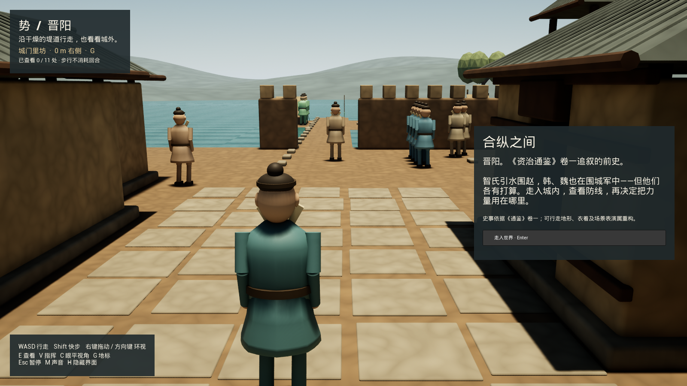
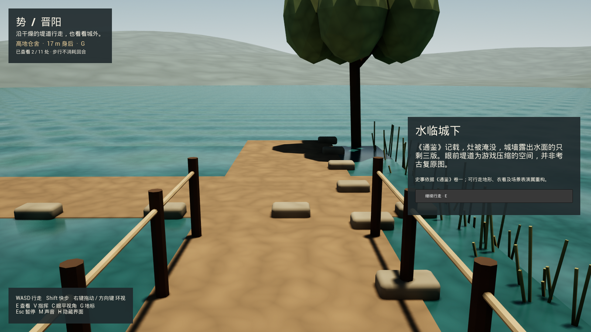

# Jinyang — enter the world

2026-10-03 development checkpoint. This adds a walkable place to the existing decision-to-ending encounter, not a new completed campaign or mobile release.

## What changed for the player

Enter the gate quarter, walk between houses and the raised storehouse, climb the watch platform, inspect the flood, and follow the levees toward the camps. Eleven landmarks connect the human-scale view to the existing command scene. Walking and inspecting do not spend orders or supplies. `V` returns to command; the same campaign model still determines diplomacy, military responses and the estate record.

The world includes editable Blender buildings, earthworks, stairs, camp props, vegetation and a continuous distant terrain. Three residents follow presentation-only carrying/walking routines. Character movement, collision, first/third-person cameras, landmark bearings, pause, reduced camera motion and separate exploration persistence are implemented. These figures and materials are **stylized development art**, not the accepted final cast or cinematic-quality target.





The historical basis is the earlier Jinyang episode recounted in *Zizhi Tongjian*, volume I, not a siege dated 403 BCE. The supplied original and modern translation were consulted for the flood and coalition. Distances, buildings, costumes, traversable levees and resident routines are gameplay reconstruction, not archaeological measurements. Private source units/hashes remain outside Git.

## Play

| Input | Action |
| --- | --- |
| Enter | Begin exploring |
| WASD / Shift | Walk / move faster |
| Arrow keys / right-drag | Look around |
| E | Inspect a nearby landmark; E or Esc closes it |
| C | Switch eye-level / third-person view |
| G | Select the next landmark bearing; this is not pathfinding |
| V | Switch exploration / command view when an order is not playing |
| Esc | Pause exploration |
| R / Q in pause | Reduced camera motion / save and leave |
| M / H | Toggle provisional sound / hide scenic interface |

Pause, inspection and entry controls remain visible even when scenic interface is hidden. Command mode retains the documented order controls. No touch/controller acceptance is claimed for this keyboard development build.

Use the single project-owned isolated noVNC desktop for current reviews. Do not open or manipulate the owner's physical desktop without a new explicit request. The private runtime handoff records the current URL and exact cleanup ownership.

```bash
node scripts/launch-jinyang-review.mjs .runtime/jinyang-review \
  --explore --zh --package=/absolute/path/to/packaged/Linux
```

`scripts/launch-jinyang-desktop.mjs` is an optional ordinary-window launcher, only on request. The noVNC launcher works with either the packaged player or the installed editor-backed player; it refuses an occupied display/port and enforces memory preflight.

## Source and build

- Geometry: `scripts/build-jinyang-world.py`, Blender 4.0.2; [source and provenance](../../assets/3d/jinyang-world/PROVENANCE.md).
- Import: `scripts/import-jinyang-world-unreal.py`, Unreal 5.8.1.
- Four scenery layers total 60,055 triangles; tunic/robe add 424 triangles per pair. Ground/architecture carry walking collision; scenery details and horizon do not.
- Runtime scenery Y reflection corrects the FBX axis conversion, keeping the canonical campaign sites unchanged.
- `ShiJinyangExplorer` owns movement/cameras; `ShiJinyangWorld` owns exploration presentation; `ShiJinyangWorldSave` stores only position, look, camera mode and known visited landmarks.
- Final local package: `SHI-Jinyang-World-20261003/Linux`; previous verified package: `SHI-Jinyang-World-20261003-r2/Linux`. The final build replaces the earlier superseded generated package, not source assets or saves. BuildCookRun succeeded in 78.29 seconds.
- Final executable SHA-256: `0d14232cd06a22775ec613347a2c95bebc21efcb794e7c3f97c237354457e52d`.
- This is an approximately 1.1 GB Linux Development package, including engine/debug payload, not a mobile download-size forecast or a public binary release.

## Observed checks

The actual player was operated with keyboard input, not solely repositioned by fixtures:

1. Walked the street, climbed the short stair, reached the flood and traversed the northern levee. These movements/inspections left a zero-order campaign byte-identical.
2. Reached Han's camp, switched to command, issued one defense order, let its presentation settle, and returned to exploration. A later cold restart restored the same campaign history, position, facing, camera mode and three visited places without another order.
3. Tested English and Simplified Chinese panels, pause/quit, first-person and third-person views. An observed NPC intersection was repaired with walking obstacles and resident yielding. This is selected route coverage, not exhaustive collision certification.
4. Full repository validation passed 113 game-core and 416 web tests. Final native automation exited successfully with four passing tests: interface visibility, exploration save, motion endpoints and replay parity. Replay parity covers 52 legacy and 109 revision-2 complete-state checkpoints. The modal-visibility regression covers all 16 flag combinations.

The actual one-order cold-save SHA-256 is `b097302923a5fe927176d447f92bcc270d683a114cae2f5ea07a40abfce8c2fd`. Raw logs, saves, recordings and package receipts are retained privately. The illustrative screenshots contain only SHI, not account/device interfaces.

The final hidden-interface repair has native regression coverage, but its final packaged UI recheck is deferred: the shared Linux host's swap rose above its admission limit after the rebuild. The earlier packaged walking/order/cold-resume review remains valid for the unchanged paths; do not relabel it as a fresh visual test of the final modal fix. The isolated preview is closed pending a safe resource window; no other project's processes were stopped.

A 600-frame ordinary-desktop startup sample measured median frame time 4.19 ms and p95 11.11 ms, but included a 2.67-second loading hitch. It does **not** qualify sustained play. An earlier Xvfb+video-capture sample averaged 58.8 ms/frame; capture overhead and native rendering must be measured separately. Neither sample establishes iPhone/iPad/Android performance or heat behavior.

## Mac mini / native iOS compatibility

The existing SwiftUI/SceneKit client was built and exercised on the owner's Apple Silicon Mac mini through the pinned tunnel, using Xcode 27 and iOS 27 simulators. The isolated unsigned `art.lazying.shi.upgradeqa` identity leaves the store app untouched. iPhone 17 and iPad Pro 11-inch (M5) each passed **32 unit tests plus one complete gameplay/background/cold-resume UI test**: 33 passed, zero failed or skipped on each device. They ran serially; both owned simulators were shut down afterward.

The first iPhone attempt passed the UI route but failed its draft-resource boundary test because reused QA build products retained six old draft files. The source and freshly generated project excluded them. A fresh project-owned DerivedData build passed the same unmodified test; failed and corrected results are both retained. Do not reuse app-product directories across different QA identities. The Xcode results retain a QoS runtime warning; this is functional compatibility testing, not performance qualification.

Frozen native-source archive SHA-256: `7c88880fe519791c448f1ecaf30e7ecddb301629ae9a4845846b93ef4bc264c2`. Generated unsigned QA-project archive: `4becc262ee8c9b707f7d614b692e70350e49896987d193a6fd927a0426082f72`. Sources were not changed to make the retry pass. These tests cover the **existing Qin client**, not the new Jinyang world, new film/music, physical devices, Android or a native macOS executable. All four known Mac routes were reached for tool/resource inventory; only the Mac mini performed this simulator matrix. No store upload occurred.

## Still required

This does not finish G1 or G2. The underlying route is still about five minutes of automated play. The defense assignment encounter, final cast/rig/contact quality, listening-reviewed Musia score, approved LocalVideoGen inserts, touch controls, novice understanding, sustained device performance and new mobile betas remain open. No new movie or accepted Musia cue was integrated in this checkpoint. Existing provisional sound must not be advertised as a finished score.

Next player-visible work: make the opening work-party allocation playable **in this world**—competing defense/exit/diversion jobs, visible routes and material consequences—then carry those decisions through the existing liaison and operation. Refine the cast and short performance as part of that sequence, not another isolated asset loop. iOS, Android and macOS delivery must preserve the shared decisions and source boundaries.
