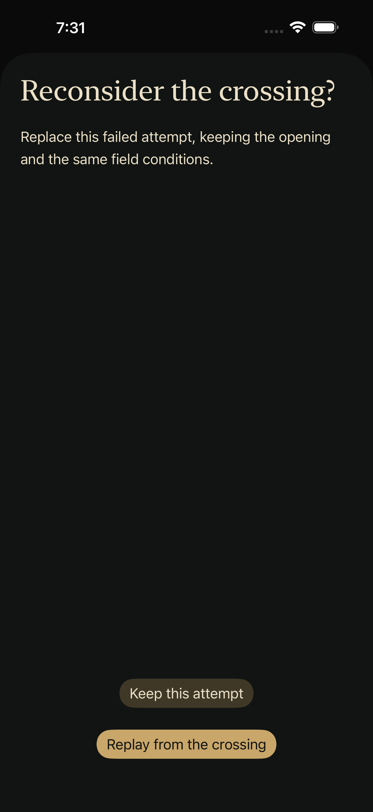
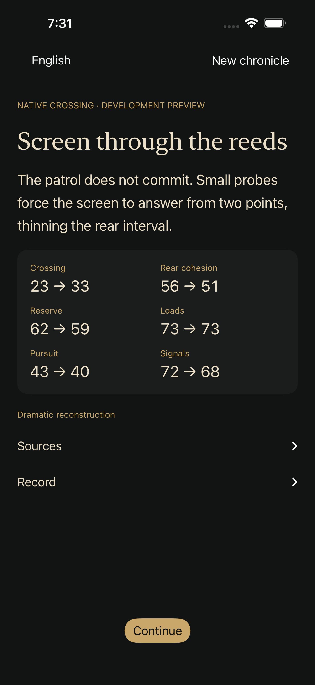

# Native crossing: understandable consequences and phone recovery

October 1, 2026. Development-only crossing QA; no store submission.

## Player improvement

Crossing reactions now show before → after values, derived from the committed
turn rather than a second simulation. Tactical values include the patrol's
response; chapter resources include the existing consequence layers. Accessible
labels retain the metric name and both values. Text can wrap rather than shrink.

The record now includes the actual field orders and their observed responses,
both during the crossing and after its conclusion. It does not reveal unissued
orders or prospective responses. A confirmed failed-route replay discards the
old attempt's later history; the reconstructed record shows the revised attempt.
An opaque retry sheet explicitly offers **Keep this attempt** and **Replay from
the crossing**, with fixed actions outside its scrolling explanation. A failed
save keeps the sheet and its error visible; it closes only after a successful
confirmed replay. The existing phase guard remains in force.
Chinese reactions use **继续**, rather than the title-screen phrase **继续旧局**.

These changes make trade-offs and recovery easier to understand. They do not
rebalance the rules, change historical prose, introduce new save formats or
advance the cinematic-media admission gate.

## Verification scope

The production, retreat and crossing configurations pass full-source typechecks
on the existing Xcode 26.3 / Swift 6.2.4 Mac. The first compilation caught a type
mismatch between a completed engagement and its serialized snapshot in the new
record view; using typed engagements consistently fixed it before UI testing.

The selected simulator is SHI's existing iPhone 17 Pro Max, iOS 26.3.1, x86_64,
not a physical phone or a minimum-width device. The first run passed the full
opening-to-Chen cold-resume route and Chinese accessibility XXXL/rotation. Its
retry test failed because the native confirmation popover omitted the explicit
cancel button; the observed accessibility hierarchy contained only Replay.
An intermediate alert made retaining the attempt explicit, but its screenshot
showed poor translucent contrast over the scene. It was rejected in visual review
and replaced with the opaque sheet. A second-run record lookup also exposed
SwiftUI propagating a parent accessibility identifier to every record child;
removing that parent identifier preserved distinct order identifiers.

Final retry-only run4 passed: 1 test, 0 failures, 0 skips. It exercises failure,
cancel, relaunch, confirmed replay, restored opening resources, another relaunch,
different orders, a surviving ending and the revised record without the discarded
order. All three native configurations were typechecked again before that run.
The second run separately passed Chinese accessibility XXXL, portrait/landscape,
the corrected Continue label and unread-response cold resume. The first run
passed the full opening-to-Chen phone route. These are scoped results across
iterations, not a claim that all three tests ran on the final binary.

All five final recovery captures received agent visual inspection. The opaque
confirmation and before/after feedback are readable. The expanded record shows
the three actual revised orders; its scrolling text can still appear underneath
the translucent top toolbar, which remains a presentation-polish issue. This is
not final visual approval of the entire app. Existing iPad evidence belongs to
the preceding checkpoint, not this edited presentation.

Follow-up: the [small-phone checkpoint](NATIVE_CROSSING_SMALL_PHONE_20261001.md)
fixes the toolbar overlap and runs all three crossing tests on the same iPhone SE
simulator binary. This does not retroactively broaden this report's evidence.

See the [source hashes, test boundaries and capture provenance](evidence/native-crossing-phone-20261001.json).
The full local `npm run build` passed validation, core/web tests and deployment
budgets. Native-content parity, 27 story-authoring tests and the 11-language
README structural check also passed. Historical prose and deterministic
rules were unchanged. Both SHI simulators were shut down after capture, and the
owned build/runner processes were verified absent. No idle GUI was retained.

Physical devices, smaller phone widths, human enjoyment, VoiceOver operation,
commercial media admission, signing, upgrade qualification and tester
availability remain separate gates. The formal production root and released
saves stay outside this isolated preview.
