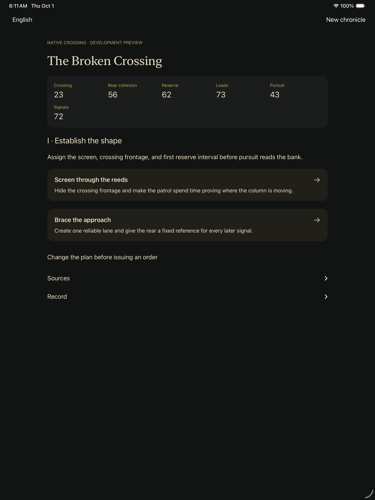
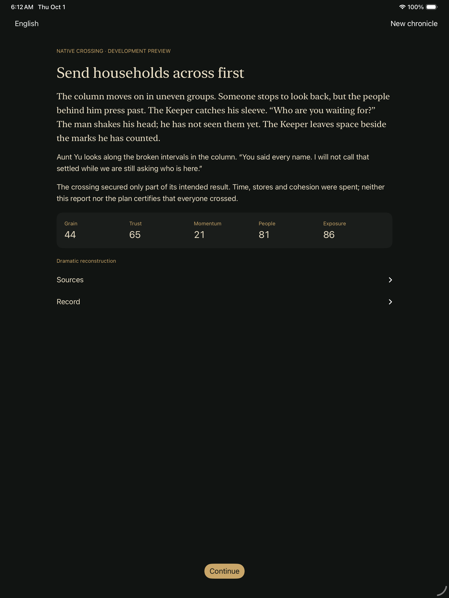

# Native crossing: playable continuity checkpoint

October 1, 2026. Scope: isolated unsigned iPad simulator QA, not a store update.

## Direction retained from the owner's conversation

Make 《势》 an emotionally engaging historical strategy drama, using the supplied
《资治通鉴》 as the spine, not a chronological slideshow. Recorded history,
interpretation, reconstructed dialogue and player counterfactuals remain distinct.
First complete opening → crossing → Chen with meaningful costs, opposition,
recovery and consequences that continue into later scenes. Wider Qin/Chu–Han
and possible Tokugawa stories follow coherent episodes, not simultaneous scope
expansion. Patient development takes precedence over raw generation speed.

Use original consistent characters; the owner's face is unnecessary. Produce
scene-specific Musia music, low-resolution-first LocalVideoGen trials, image
generation and reusable Blender animation, with OpenSCAD for suitable props.
Review identity, geography, motion, rights and actual audio/video before admission.
Musia B remains the private working choice; keep the other candidates available.
No new media was admitted in this checkpoint.

Maintain native SwiftUI iOS alongside Android, web and the existing Unreal work.
Use relevant shared Macs/devices safely rather than occupying every host. Publish
validated GitHub/site checkpoints and qualify meaningful owner-only mobile
betas; do not equate upload, availability, review approval and public release.
Preserve US$0.99/all eligible markets and public-release/paid-generation gates.
The active goal remains incomplete; there is no unattended daily scheduler.

## Player-facing change

The native development route now offers field orders rather than substituting
the abstract crossing result. Plans establish priorities; actual orders determine
the outcome and the personal reaction. Each decision and its unread reaction are
saved before display. Closing the app resumes the saved scene without issuing
the order again. Cancelling a plan is allowed before the first order, not after.
An explicitly confirmed failed-crossing replay keeps the opening and seed.

Chen continuation is bound to the full tactical ledger and rules fingerprint.
Different field histories with identical abstract choices/resources no longer
share a council save. Legacy chapter identity and released saves remain unchanged.

## Evidence and review

The actual Xcode result reports **1 passed, 0 failed, 0 skipped** on an iPad Pro
13-inch (M4) simulator, iOS 26.3.1, x86_64, using Xcode 26.3 / Swift 6.2.4.
The test chooses names → grain tallies → families first → screen through reeds
→ repair landing → wait for last household → root in villages, then defers the
title, shares the ledger and agrees one command at Chen. Three app relaunches
preserve field, personal-consequence and council progress. Chapter-end resources:
grain 48, trust 83, momentum 11, people 97, exposure 96.

Foundation checks pass five session groups, including eight outcome/failure
categories and 64 cold-resumed events, disk/backup failure, stale callbacks,
confirmed replay and malformed-save preservation. Existing council regression
passes 77 routes / 231 turns. Production, retreat and crossing configurations
are typechecked separately; actual generated Xcode projects are checked for
resource/flag/bundle isolation. The Linux full build passes 473 core/web tests.

The first UI run failed because a test helper treated the fixed Confirm footer
as part of the scroll view. The corrected test checks the footer's actual
hittability; the successor passed. No game rule or fixture changed to force it.

Agent visual inspection covered all eight result attachments. The opening,
orders, reactions and endings have readable wrapping and reachable controls in
these captures. Intent is compact on cards; the confirmation sheet contains the
full forecast. The partial crossing result does not falsely certify that all
households arrived. This is screenshot review, not human enjoyment testing.

The two unmodified PNGs are Xcode test captures of SHI's own development UI,
reviewed for documentation evidence, not new game art. Existing project rights
apply; they grant no new reuse license. Source/capture hashes and boundaries are
in the [evidence record](evidence/native-crossing-playable-20261001.json).

## Still open

- Text-heavy screens and the schematic map are not final cinematic presentation.
  Add reviewed imagery/motion/music to named beats without surrendering pause,
  skip, readable reactions, reduced motion or explicit player control.
- Qualify phone widths, large type, rotation, Chinese, failed-route replay and
  recovery UI. This preview explicitly falls back to English outside en/zh-Hans.
- Verify physical iPad/phone performance, retained-save upgrades and human
  playability before a signed candidate. Do not upload the simulator QA identity.
- No TestFlight/Play upload, signing, public store promotion or paid generation
  occurred. The formal app/root and its content admission remain separate.
- One owned simulator/build was used and shut down after capture. No active SHI
  GUI/noVNC stack is retained; foreign services and inherited Unreal edits remain
  untouched.
