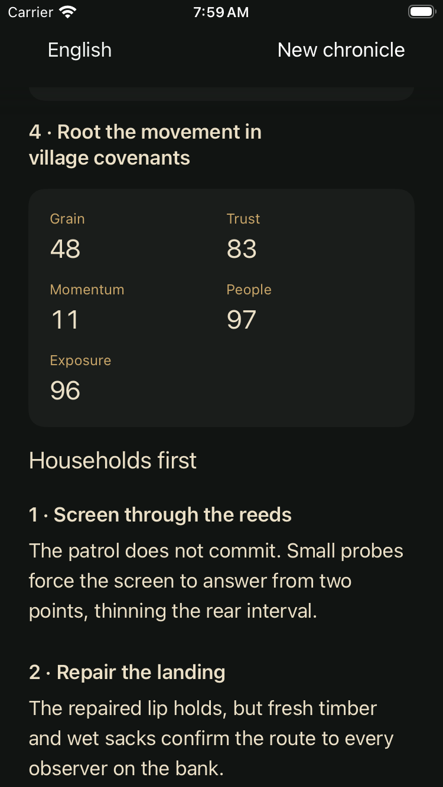
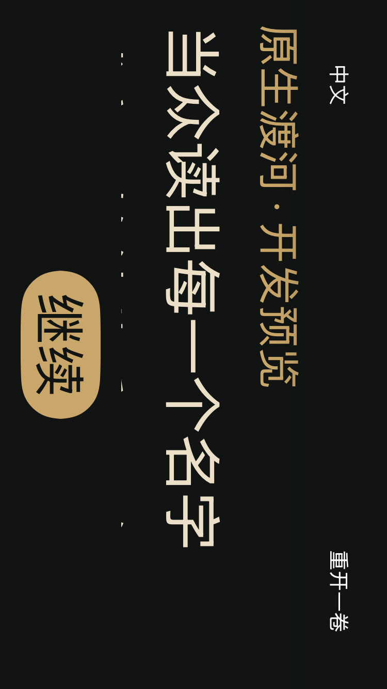

# Native crossing: smaller-phone qualification

October 1, 2026. Development-only simulator route; not a beta upload.

The preceding phone review found scrolling record text visible through the
navigation bar. The crossing scene and its order-preview sheet now use the same
explicit opaque navigation background as the existing council, Fan Yang and
retreat scenes. No game rules, narrative content, save format or release flag
changed.

The test target is an isolated iPhone SE (3rd generation) simulator using the
already installed iOS 26.3.1 runtime on the existing Xcode 26.3 / Swift 6.2.4 Mac.
The production, retreat and crossing source configurations passed typechecking.
The three UI checks use one binary and one sequential test job: full route to
Chen with cold resumes, failed-route cancel/replay with revised orders, and
Chinese accessibility XXXL with rotation. The actual result bundle reports
**3 passed, 0 failed, 0 skipped** on that same binary. This is not inferred from
the previous Pro Max run. The unchanged test assertions cover before/after
values, restored opening resources and replacement of the discarded order.

The phone has a 375×667-point portrait viewport (750×1334 capture). Eighteen
screens were captured; six key screens received agent visual inspection: the
expanded order record, Chinese portrait metrics, Chinese landscape reaction and
order preview, replay confirmation and Chen conclusion. The toolbar now masks
the scrolling prose cleanly. At accessibility XXXL, numeric changes wrap and
prose needs scrolling; the fixed Confirm/Continue controls remain reachable.
This is bounded legibility/control evidence, not a human enjoyment review or
proof of every locale, orientation and screen.

[Capture provenance and source hashes](evidence/native-crossing-small-phone-20261001.json)
identify the exact tested inputs. The existing shared runtime and build cache
were reused. All three SHI simulators were shut down after the run and the owned
build/test processes were verified absent. No foreign service or SDK changed.

Native-content parity, repository validation, 27 story-authoring tests, the
11-language README structural check and all four source/capture hash checks
passed locally. Both GitHub validation and website deployment for the base
`7ec0d58` succeeded; a successor commit needs its own CI result.

Physical-device performance, VoiceOver operation, retained release-save upgrades,
signing, beta distribution and cinematic asset admission remain separate gates.
The existing production app and its saves are not replaced by this QA bundle.
