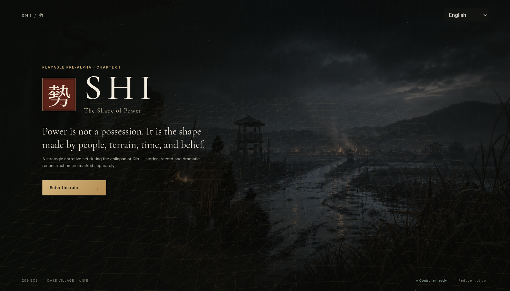

<div dir="rtl">

[English](../README.md) · [العربية](README.ar.md) · [Español](README.es.md) · [Français](README.fr.md) · [日本語](README.ja.md) · [한국어](README.ko.md) · [Tiếng Việt](README.vi.md) · [中文 (简体)](README.zh-Hans.md) · [中文（繁體）](README.zh-Hant.md) · [Deutsch](README.de.md) · [Русский](README.ru.md)

[](https://github.com/lachlanchen/lachlanchen/blob/main/figs/banner.png)

# SHI · هيئة القوّة / 《勢》

*سرد استراتيجي جميل وأمين للتاريخ عن تحوّل الناس والأرض والوقت والإيمان والإمداد والمؤسسات إلى قوّة.*

[](https://github.com/lachlanchen/ShiGame/actions/workflows/ci.yml) [](https://lachlanchen.github.io/ShiGame/) [](../apps/unity/) [](https://github.com/sponsors/lachlanchen)

SHI مشروع لعبة حقيقي قيد الإنتاج، لا عرض مؤقت. يبدأ الفصل الأول القابل للعب تحت مطر قرية دازِه سنة 209 ق.م. يلعب المستخدم دور أمين سجل تجنيد متخيَّل ويقرر كيف تتحول جماعة عالقة إلى حركة سياسية. تمتد الحملة نحو سقوط تشين وصراع تشو وهان من دون جعل شيانغ يو أو ليو بانغ أو النصر اللاحق قدرًا محتومًا.

| Donate | PayPal | Stripe |
| --- | --- | --- |
| [](https://chat.lazying.art/donate) | [](https://paypal.me/RongzhouChen) | [](https://buy.stripe.com/aFadR8gIaflgfQV6T4fw400) |



## ما الذي يميّز SHI؟

- المؤن والثقة والزخم والناس والانكشاف تصنع موقعًا استراتيجيًا ولا تختزل في رقم قوة واحد.
- السرعة قد تصنع الجوع، والشرعية دينًا، والسرية ضعفًا في الثقة؛ وكل خيار يخلق ردًا ومشكلة تعافٍ.
- تُفصل الروايات التاريخية والتجميعات اللاحقة والنصوص الاستراتيجية وإعادة البناء الدرامي بوضوح.
- يشترك تطبيق الويب ومشروع Unity 6 الحقيقي في ملف حملة واحد ذي إصدار.
- توجد بنية واجهة لإحدى عشرة لغة، واتجاه RTL عربي، وسجل مصدر ومراجعة لكل أصل مولّد.

## المحتوى الحالي

| المسار | المنجز فعليًا |
| --- | --- |
| [`apps/web`](../apps/web/) | ويب قابل للعب، حفظ، سجل مصادر وقرارات، هاتف، RTL |
| [`apps/unity`](../apps/unity/) | Unity 6 وطاولة عمليات ثلاثية الأبعاد؛ ثُبّت محرر Linux/WebGL، ولا يزال تسجيل دخول الترخيص بوابة معلنة |
| [`content`](../content/) | 6 مشاهد، 15 خيارًا، 5 موارد، دور تعافٍ، 3 نهايات |
| [`docs`](../docs/) | تصميم وتاريخ وهندسة وتعريب وفن واختبار ونشر وخطة سنة |

## بدء سريع

```bash
npm install
npm run dev
npm run validate
npm run build
```

## الهندسة وخط البحث

ملف JSON ذي الإصدار هو مصدر السرد الوحيد، وتتشاركه قواعد TypeScript الحتمية وUnity 6. الكتب الخاصة وOCR والمحادثات والمذكرة الكاملة لا تدخل Git. راجع [تصميم اللعبة](../docs/design/GAME_DESIGN_DOCUMENT.md) و[سياسة المصادر](../docs/history/SOURCE_POLICY.md) و[خطة السنة](../docs/production/ROADMAP.md).

## البناء والتحقق

يفحص التحقق الآلي شبكة الحملة والمراجع ومفاتيح اللغات والقواعد والأنواع والاختبارات. واجتاز اختبار noVNC/Chrome المرئي 50 فحصًا للعب واستجابة الضغط ولوحة المفاتيح والمصادر والحفظ وRTL والهاتف وWebGL ووحدة التحكم. [الدليل هنا](../docs/production/PLAYTESTING.md).

## الاستشهاد

عند استخدام SHI في البحث أو التعليم، استشهد بملف [`CITATION.cff`](../CITATION.cff).

```bibtex
@software{chen_shi_2026,
  author = {Chen, Lachlan},
  title = {SHI: The Shape of Power},
  year = {2026},
  url = {https://github.com/lachlanchen/ShiGame}
}
```

## الحالة والنطاق

نسخة إثبات الأنظمة ما قبل ألفا بتاريخ 2026-08-09. يضم فصل الويب استجابات ضغط حتمية وترحيل الحفظ وتحكم لوحة المفاتيح وفحص كل المسارات و50 اختبارًا مرئيًا. ثُبّت محرر Unity الحقيقي مع Linux/WebGL وتعرّف إليه Hub. يتطلب الاستيراد والتجميع الأصليان تسجيل دخول مالك الحساب وتفعيل ترخيص Unity، مع إبقاء إصدار Unity 6 الإنتاجي مثبتًا. لن يُعلن الاكتمال قبل اجتياز العميلين والبحث واللغات والأصول واختبارات اللعب والإصدار.

</div>
