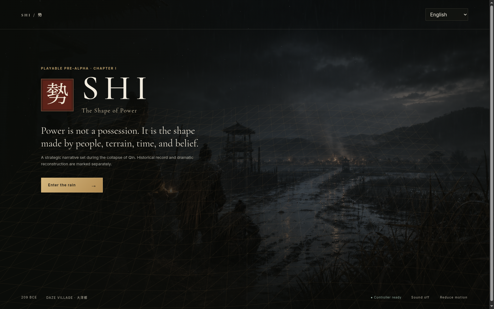

[English](../README.md) · [العربية](README.ar.md) · [Español](README.es.md) · [Français](README.fr.md) · [日本語](README.ja.md) · [한국어](README.ko.md) · [Tiếng Việt](README.vi.md) · [中文 (简体)](README.zh-Hans.md) · [中文（繁體）](README.zh-Hant.md) · [Deutsch](README.de.md) · [Русский](README.ru.md)

[](https://github.com/lachlanchen/lachlanchen/blob/main/figs/banner.png)

# SHI · The Shape of Power / 《势》

*لعبة تاريخية عن قرارات تغيّر حياة الناس.*

[Web](https://lachlanchen.github.io/ShiGame/) · [Story](https://lachlanchen.github.io/ShiGame/story/) · [App Store](https://apps.apple.com/us/app/id6816377548) · [Google Play](https://play.google.com/store/apps/details?id=art.lazying.shi) · [Sponsor](https://github.com/sponsors/lachlanchen)

| Donate | PayPal | Stripe |
| --- | --- | --- |
| [](https://chat.lazying.art/donate) | [](https://paypal.me/RongzhouChen) | [](https://buy.stripe.com/aFadR8gIaflgfQV6T4fw400) |



## اللعبة

تبدأ SHI تحت المطر في دازه سنة 209 قبل الميلاد. تؤدي دور أمين سجل تجنيد متخيّل؛ تحدد المؤن والثقة والناس والانكشاف الوعود التي تستطيع الوفاء بها. تخلق الخيارات كلفة ومقاومة ومسارات تعافٍ، ولا تضمن النصر. كتاب «تسي تشي تونغ جيان» هو العمود التاريخي؛ الحوار المعاد بناؤه والنتائج البديلة موسومة وليست اقتباسات تاريخية.

## التطبيقات

يستخدم الويب React/Three.js وقواعد TypeScript حتمية. تطبيق iOS أصلي عبر SwiftUI/SceneKit/Foundation؛ ويغلف Android اللعبة دون اتصال. Unreal 5.8 عميل سينمائي لسطح المكتب، وUnity 6 أساس للمحتوى المشترك. تستخدم التطبيقات بيانات حملة ذات إصدار، لا روايات تاريخية منفصلة.

[Web](../apps/web/) · [iOS](../apps/mobile/ios/) · [Android](../apps/mobile/android/) · [Unreal](../apps/unreal/) · [Unity](../apps/unity/) · [Rules](../packages/game-core/) · [Content](../content/)

## تشغيل محلي

يلزم Node.js 22+. شغّل محليًا ثم تحقق قبل البناء. إعداد التطبيقات الأصلية والمحركات موثق في مجلداتها؛ نجاح بناء الويب لا يثبت صلاحية حزمة هاتف موقعة.

```bash
npm install
npm run dev
npm run validate
npm run build
```

http://127.0.0.1:5173

## المراجعة السينمائية

السلاسة تعني أوامر سريعة الاستجابة وحفظًا دائمًا قبل رد مناسب ثم متابعة صريحة. تحتاج الموسيقى والفيديو إلى نصوص وإيقاف وتجاوز وموافقة وتقليل الحركة. يجب ثبات الوجوه والملابس الأصلية. تبقى دراسات Musia وLocalVideoGen وBlender خاصة حتى مراجعة المصادر والحقوق والصورة والصوت.

[Design](../docs/design/GAME_DESIGN_DOCUMENT.md) · [Sources](../docs/history/SOURCE_POLICY.md) · [Playtests](../docs/production/PLAYTESTING.md) · [Roadmap](../docs/production/ROADMAP.md)

## حدود الإصدار

في 2 أكتوبر 2026، تظل نسخة الهاتف المنشورة رقم 1 منفصلة عن التطوير الجديد. نسخة Apple متاحة للتنزيل؛ ونُشرت النسخة رقم 1 على Google Production في 2 أكتوبر، مع التحقق من صفحة المتجر الأمريكي بسعر 0.99 دولار أمريكي و169 سوقًا مستهدفة. أصبح TestFlight 1.0.1 (2) وإصدار Google الداخلي 1.0.0 (9) متاحين للمختبرين الحاليين؛ ولم تتغير إصدارات المتاجر العامة. توجد اختبارات محدودة للمجلس وفان يانغ والانسحاب والملجأ، لكن بعض الاستمرار للاختبار فقط. الشخصيات ليست فنًا سينمائيًا نهائيًا. الاختبارات لا تعوض المراجعة البشرية أو أداء الأجهزة الفعلية. تحديث GitHub يتبع نقطة تحقق؛ والبيتا تحتاج توقيعًا واختبار ترقية وتأكيد إتاحتها. لا يوجد مجدول يومي آلي.

[Beta workflow](../store/BETA_WORKFLOW.md) · [Native evidence](../docs/production/NATIVE_REFUGE_UI_20261001.md) · [Local video rights](../docs/production/LOCAL_VIDEO_RELEASE_GATE_20261001.md) · [Cloth study](../docs/production/COUNCIL_GUSSET_CLOTH_20261001.md)

## الاستشهاد

استشهد بملف CITATION.cff في البحث. النشر العام لا يمنح ترخيص إعادة الاستخدام؛ لا تدخل الكتب الخاصة أو المفاتيح أو الذاكرة المؤقتة إلى Git.

[CITATION.cff](../CITATION.cff) · [LICENSE.md](../LICENSE.md)

```bibtex
@software{chen_shi_2026,
  author = {Chen, Lachlan},
  title = {SHI: The Shape of Power},
  year = {2026},
  url = {https://github.com/lachlanchen/ShiGame}
}
```

Copyright © 2026 Lachlan Chen.
